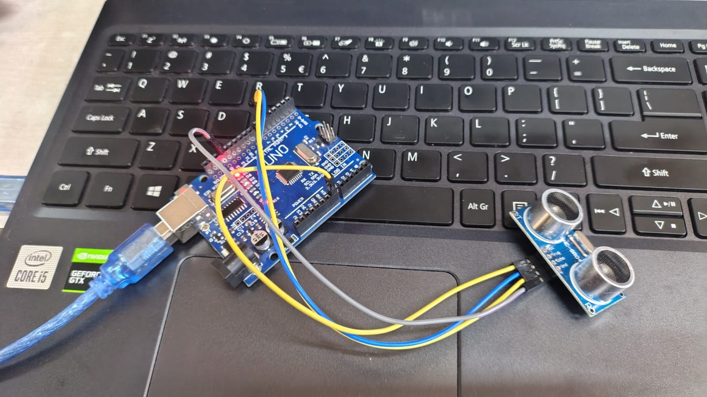

# Arduino Ultrasonic Distance Measurement System

## Overview
This project demonstrates a distance measurement system using an HC-SR04 Ultrasonic Sensor and Arduino Uno. The ultrasonic sensor measures the distance between the sensor and nearby objects by transmitting and receiving ultrasonic waves. The Arduino processes the sensor data and calculates the distance in real time.

## Components Used
- Arduino Uno
- HC-SR04 Ultrasonic Sensor
- Jumper Wires

## Working Principle
1. The ultrasonic sensor transmits ultrasonic waves.
2. The waves reflect from nearby objects.
3. The sensor receives the reflected waves.
4. Arduino calculates the distance based on the time taken for the waves to return.
5. The measured distance can be monitored in real time.

## Applications
- Distance Measurement Systems
- Obstacle Detection
- Robotics
- Smart Parking Systems
- Industrial Automation

## Skills Demonstrated
- Arduino Programming
- Ultrasonic Sensor Interfacing
- Embedded Systems
- Electronics Engineering
- Circuit Design

## Project Image

## Future Enhancements
- LCD Display Integration
- Buzzer-Based Distance Alert
- Wireless Monitoring
- IoT-Based Distance Tracking

## Author

**Anushri Jamodkar**

Diploma in Electronics Engineering

Interested in Embedded Systems, Arduino Projects, Electronics Design, and IoT Applications.

## License

This project is created for educational and learning purposes.
